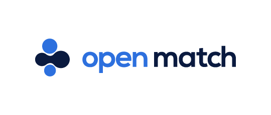

[](https://godoc.org/open-match.dev/open-match-docs)
[](https://goreportcard.com/report/open-match.dev/open-match-docs)
[](https://github.com/googleforgames/open-match-docs/blob/master/LICENSE)

[](https://twitter.com/intent/follow?screen_name=Open_Match)

This is the source code for the Open Match website, http://open-match.dev.

## Contributing

[Open Match website](https://open-match.dev/site/docs/) website can be run locally and on AppEngine.

```bash
# Run the website locally.
make run-site
# Run tests and cleanup the code.
make presubmit
```

## Support

* [Slack Channel](https://open-match.slack.com/) ([Signup](https://join.slack.com/t/open-match/shared_invite/enQtNDM1NjcxNTY4MTgzLWQzMzE1MGY5YmYyYWY3ZjE2MjNjZTdmYmQ1ZTQzMmNiNGViYmQyN2M4ZmVkMDY2YzZlOTUwMTYwMzI1Y2I2MjU))
* [File an Issue](https://github.com/googleforgames/open-match-docs/issues/new)
* [Mailing list](https://groups.google.com/forum/#!forum/open-match-discuss)

## Code of Conduct

Participation in this project comes under the [Contributor Covenant Code of Conduct](code-of-conduct.md)

## Documentation

Here are some useful links to additional documentation:

* [Get Started](https://open-match.dev/site/docs/installation/)

For more information on the technical underpinnings of Open Match you can refer to the [docs/](docs/) directory.

## Contributing

Please read the [contributing](CONTRIBUTING.md) guide for directions on submitting Pull Requests to Open Match Docs.

## License

Apache 2.0
