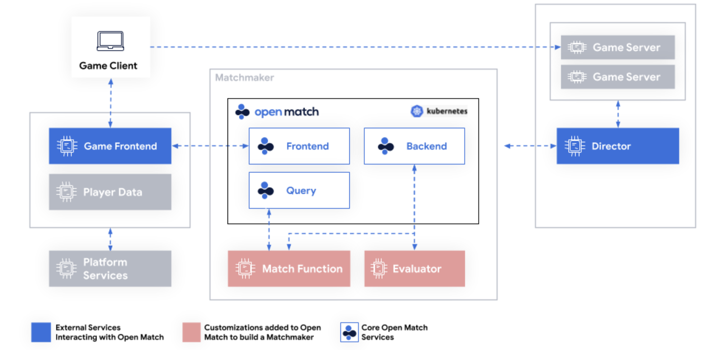
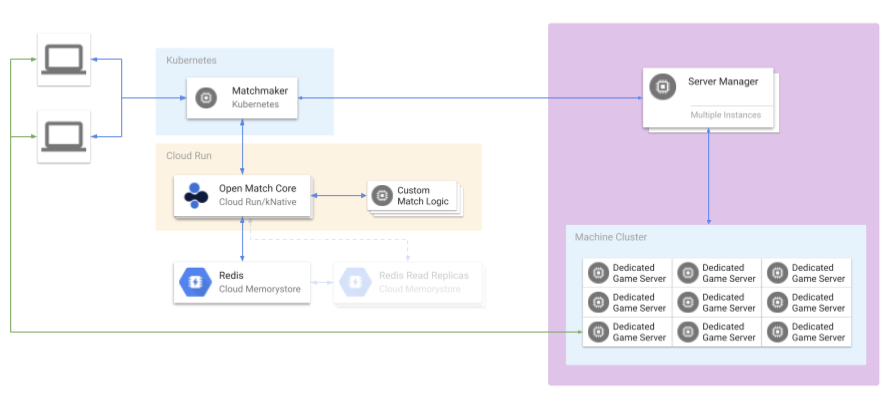

Open Match 2 is a data layer that helps your matchmaker run matching logic at scale. In technical terms, it is a player data cache with a data-retrieving gRPC proxy.

**Github Repository: https://github.com/googleforgames/open-match2**

## Core Responsibilities

It is responsible for:

- **Receiving match requests**: It acts as the central point where game clients or other services submit requests for matches.
- **Managing tickets**: Each match request creates a "ticket" representing a player or group of players seeking a match. OM2 core tracks these tickets.
- **Invoking matchmaking functions**: It uses your configured matchmaking function (MMF) to evaluate tickets and determine suitable matches.
- **Returning matches**: When the MMF finds a suitable match, OM2 core returns the match information to the requesting client or service.

## Key Differences between OM1 and OM2

- OM2 doesn’t have an evaluator, and has only one binary - Open Match Core - that combines the Frontend, Backend and Query.
    - Open Match 1 Architecture
      
    - Open Match 2 Architecture
      
- Frontend and Director communicate with OM1 via gRPC, but use HTTP to communicate with OM2. For see the Space Agon example in the Examples and 
  Migration section for details on how the HTTP requests are made.
- Redis was previously deployed in Kubernetes via helm, but is now deployed in either of the ways below:
    - On Memorystore on Google Cloud Console.
    - Deployed via a yaml config, examples can be found both the Space Agon example or Open Match 2 Github repo. You are welcome to tweak the details
      on the Redis config to verify any performance differences.

## A Unified, Flexible Core Architecture & Deployment 
The most significant architectural change in OM2 is the move from a distributed microservices architecture to a single, unified binary called `om-core`. In OM1, components like the `frontend`, `backend`, and `query` services were separate deployments. OM2 consolidates their functionality into one stateless service, which simplifies deployment, management, and reduces the number of network hops for most operations.

Each instance of the `om-core` service is designed to be fully independent. It establishes its own read and write connections to Redis and can handle API requests from both your game client services (for ticket creation via the `CreateTicket` RPC) and your matchmaker (the director, which calls `InvokeMatchmakingFunctions`).

This unified design does not preclude advanced deployment patterns. The architecture explicitly supports the ability to run separate, horizontally-scaled pools of `om-core` instances for different purposes. For example, a team could maintain a large, auto-scaling pool dedicated to the high volume of incoming `CreateTicket` requests, and a separate, smaller pool for running the less frequent but more resource-intensive `InvokeMatchmakingFunction` to ensure no design compromises prevent this flexibility.

## Build & Local Development
The developer experience for building and testing Open Match has been fundamentally reworked for simplicity and speed. OM1 relied on a complex, 1000+ line `Makefile` to manage the build and containerization process. This system was powerful but often opaque and difficult to troubleshoot.

OM2 replaces this with **CNCF Buildpacks**. This modern, cloud-native approach automatically transforms source code into an optimized, secure container image without requiring a Dockerfile or complex build scripts. This shift makes the entire build process more transparent and significantly easier to debug.

For local development, OM2 introduces a major quality-of-life improvement: a built-in in-memory state store. Previously, developers needed to run and configure a local Redis instance just to get started. Now, you can run the entire `om-core` service with a single `go run .` command, using the in-memory replicator for a fast, dependency-free development loop.

## API Streaming, gRPC Gateway, and Simplified Load Balancing
The OM2 API has been consolidated into a single, unified `OpenMatchService`. This replaces the multiple gRPC endpoints of OM1 and introduces a more efficient, streaming-based approach for receiving match results from your Matchmaking Functions (MMFs).

A key improvement is the native integration of a **gRPC-Gateway**. This gateway automatically exposes a full-featured HTTP/JSON REST interface alongside the primary gRPC endpoint. While gRPC is highly performant, implementing robust, client-side load balancing can be a significant challenge across different languages and environments. By providing a standard HTTP interface, OM2 allows developers to leverage industry-standard, server-side HTTP load balancers provided by cloud platforms. This simplifies client architecture, improves reliability, and makes the API accessible to a wider range of services that may not have mature gRPC tooling.

## State Management Optimized for Redis Read Replicas
Open Match 2 introduces an in-memory `ReplicatedTicketCache` within each `om-core` instance to replace direct Redis queries. As a result, all ticket reads for invoking MMFs are now coming from local memory, making them as fast as possible.

For production environments, Redis is used as the ticket replication mechanism between each `om-core` instance. Each `om-core` instance is configured with distinct **read and write Redis endpoints**. In a typical production topology, all instances would point their write configuration to a single Redis primary instance. The read configuration, however, would point to one or more read replicas. This allows you to distribute the high volume of ticket-pooling reads across multiple replicas, dramatically increasing the read throughput of your matchmaking system. This design avoids the need for more operationally complex topologies like Redis Cluster or the use of Redis Sentinel, providing massive scalability with a simpler infrastructure footprint, and one that is simple to stand up and get production ready quickly using Cloud Memorystore for Redis on Google Cloud.

## Configuration: The 12-Factor Approach
OM2's configuration system has been entirely reworked to be simpler, more discoverable, and more aligned with modern cloud-native principles. It fully embraces a **12-factor app methodology**, where all configuration is managed through environment variables.

This approach eliminates the need to manage configuration through layered YAML files applied in opaque ways by complicated Helm charts. More importantly, all configuration has been centralized into a single Go code module (`internal/config`). This module serves as the single source of truth where every configuration variable: its default value and purpose are defined and documented directly in the code. When the `om-core` service starts, it logs all the values it is using at the `debug` log level. This makes exploring and understanding the available settings significantly simpler than in OM1, as developers can go to one place in the code to see every possible configuration option without hunting through Helm charts or external documentation.  Updating a value is as simple as making a new `om-core` deployment with the adjusted environment variable values, which is well supported by cloud-native platforms such as GKE and Cloud Run.

## Match Resolution and Ticket Collision Handling
One of the most fundamental architectural changes in Open Match 2 is the complete redesign of the match resolution process and the handling of ticket collisions. This change marks a philosophical shift away from a framework-managed resolution process toward a more performant and explicit developer-managed model. The new approach removes significant internal complexity from Open Match, giving developers greater flexibility and clearer ownership over the final state of their matches.

In Open Match 1, the framework was deeply involved in ensuring match uniqueness through a multi-stage process involving a `synchronizer` and an `evaluator`. Matchmaking Functions (MMFs) did not produce final matches; they produced match proposals. These proposals were funneled into a "synchronization window," a period during which the `synchronizer` component collected all proposals from concurrently running MMFs. Once this window closed, the collected set was passed to the `evaluator`. The `evaluator` was a mandatory service where developers were expected to inject their own logic to resolve "ticket collisions"—instances where multiple proposals contained the same ticket.

While powerful in theory, this design created a high barrier to entry. Developers had to deeply understand the complex internal loop to write an effective evaluator. In practice, this complexity led most to avoid writing a custom evaluator, instead defaulting to the basic example provided. This anti-pattern meant many developers were entirely unaware that ticket collisions were happening or that their resolution was critical for the performance and correctness of a highly-concurrent matchmaker, invalidating the core assumptions of the OM1 design.

Open Match 2 solves this by removing the `synchronizer` and `evaluator` entirely. Its responsibility now ends with orchestrating MMFs and streaming their results back to the client. OM2 is no longer aware of ticket collisions; if two MMFs return matches with an overlapping ticket, it will not intervene. The responsibility for collision detection and resolution now rests explicitly and entirely with the developer's matchmaker code (the director). The matchmaker receives a stream of finalized matches and must perform its own check to ensure a ticket has not already been used before assigning it to a game server. This trade-off—giving up internal collision management—yields tremendous benefits: significantly lower latency by eliminating the synchronization window, a radically simpler core architecture, and complete flexibility for developers to implement collision resolution in the manner that best suits their needs.

## A Shift from Polling to Push Assignments
The process for retrieving match assignments has been fundamentally redesigned in Open Match 2 to vastly improve scalability and simplify client-side logic. The new architecture moves away from the inefficient client-side polling pattern of OM1 to a more robust, centralized model.

In OM1, after creating a ticket, each game client was responsible for calling `GetAssignments` and entering a long-polling loop, repeatedly querying the `om-frontend` service. This pattern created significant scalability challenges, requiring every client to maintain a persistent gRPC stream with Open Match, which consumed substantial resources on the frontend service.

To ease the transition from the previous version, Open Match 2 provides legacy endpoints that replicate OM1's assignment responsibilities. However, these methods are marked as **deprecated** and are included only to lower the initial migration burden. **Developers should consider these a temporary compatibility layer and plan to move away from them as soon as convenient.**

The recommended and forward-looking approach in OM2 is for the **Matchmaker** to handle all assignment logic. The Matchmaker (aka 'director') has always been responsible for determining which game server a match would be assigned to.  With the move to OM2, the path for your matchmaker to send assignments out to game clients should no longer use OM as an intermediate; **instead it is responsible for sending the assignment to your client notification mechanism directly**.  This centralized model is vastly more scalable, moving from thousands of polling clients to a single, authoritative service receiving match data. It simplifies game client logic and fosters a cleaner architecture by decoupling the client from the assignment-retrieval process. It also integrates more cleanly with typical game online service suites, which typically already have a performant client notification mechanism. 